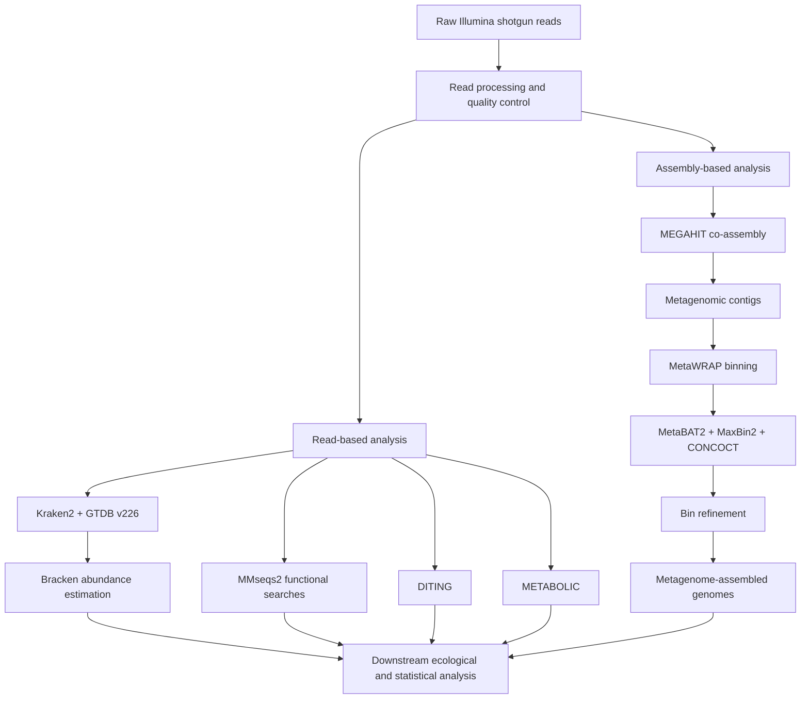

---
# MBRACE Metagenomics — November 2025

**Shotgun metagenomics | Environmental microbiome | HPC bioinformatics | Genome-resolved metagenomics**

## Project Overview

This repository contains bioinformatics workflows developed for analysis of the **November 2025 shotgun metagenomic dataset from the MBRACE project**.

We investigated microbial community composition and functional potential across Mississippi coastal and estuarine environments. The metagenomic component is designed to characterize microbial taxonomy, metabolic potential, biogeochemical functions, and metagenome-assembled genomes (MAGs).

The analysis is organized into two complementary approaches:

1. **Read-based analysis** — taxonomic and functional profiling directly from metagenomic sequencing reads.
2. **Assembly-based analysis** — metagenome assembly, taxonomic characterization, genome binning, bin refinement, and recovery of MAGs.

Most computational analyses are performed on a **Linux high-performance computing cluster using SLURM**, including job arrays and parallelized workflows for processing multiple metagenomic samples.

---

## Analysis Workflow

---

# Read-based Metagenomic Analysis

The read-based workflow characterizes microbial taxonomic composition and functional potential without depending exclusively on genome reconstruction.

| Step | Script                      | Purpose                                                                          |
| ---- | --------------------------- | -------------------------------------------------------------------------------- |
| 1    | `01_taxa-kraken.sh`         | Taxonomic classification using **Kraken2** and the **GTDB v226** database        |
| 2    | `02_taxa-bracken.sh`        | Refine Kraken2 classifications and estimate taxonomic abundance with **Bracken** |
| 3    | `03_taxa-bracken-merge.sh`  | Merge sample-level Bracken outputs into abundance matrices                       |
| 4    | `04_taxa-go-check.sh`       | Check and validate taxonomic workflow outputs                                    |
| 5    | `05_function-jobfiles.sh`   | Generate sample-specific jobs for functional sequence searches                   |
| 6    | `06_function-mmseqs-run.sh` | Perform parallel **MMseqs2** searches on the HPC cluster                         |
| 7    | `07_function-tophit.sh`     | Extract and organize top functional sequence matches                             |
| 8    | `08_diting.sh`              | Characterize microbial biogeochemical functions using **DITING**                 |
| 9    | `09_diting-merge.sh`        | Merge DITING outputs across samples                                              |
| 10   | `10_metabolic.sh`           | Generate sample-resolved functional abundance information using **METABOLIC**    |

Several steps are parallelized using **SLURM job arrays**, allowing multiple metagenomes to be processed simultaneously while retaining sample-specific outputs and logs.

---

# Assembly-based Metagenomic Analysis

The assembly-based workflow reconstructs longer genomic sequences and recovers microbial genomes for genome-resolved analyses.

| Step | Script                         | Purpose                                                         |
| ---- | ------------------------------ | --------------------------------------------------------------- |
| 1    | `01_merging_lane_sequences.sh` | Merge sequencing lanes into sample-level paired-end files       |
| 2    | `02_quality_control.sh`        | Summarize sequencing QC using **MultiQC**                       |
| 3    | `03_hostremove.sh`             | Remove unwanted or host-associated reads                        |
| 4    | `04_metwrap-assembly.sh`       | Perform **MEGAHIT** metagenome co-assembly through **MetaWRAP** |
| 5    | `05_metawrap-kraken.sh`        | Taxonomically characterize assembled metagenomic sequences      |
| 6    | `06_metawrap-krona-vis.sh`     | Generate interactive taxonomic visualizations with **Krona**    |
| 7    | `07_metawrap-binning.sh`       | Recover genome bins using **MetaBAT2, MaxBin2, and CONCOCT**    |
| 8    | `08_metawrap-bin-refine.sh`    | Refine candidate genome bins using MetaWRAP                     |
| 9    | `09_metawrap-blobolg.sh`       | Evaluate sequence composition and taxonomy for assembly/bin QC  |

The genome-binning workflow combines several independent algorithms to improve recovery of candidate MAGs.

---

## HPC Workflow Design

This project demonstrates implementation of large-scale metagenomic workflows on shared computing infrastructure.

Key computational approaches include:

* Linux command-line bioinformatics
* Bash scripting
* SLURM batch jobs
* SLURM job arrays
* CPU- and memory-intensive computing
* parallel processing
* Conda environment management
* large biological reference databases
* sample-specific temporary workspaces
* automatic output validation
* HPC troubleshooting and resource optimization

For example, the MMseqs2 workflow uses 60 CPUs per task and creates isolated temporary directories for individual array jobs, preventing concurrent samples from sharing intermediate files.

The assembly workflow performs MEGAHIT co-assembly through MetaWRAP, followed by genome binning with MetaBAT2, MaxBin2, and CONCOCT.

---

## Major Bioinformatics Tools

### Taxonomic Profiling

* Kraken2
* Bracken
* GTDB
* Krona

### Functional Profiling

* MMseqs2
* DITING
* METABOLIC

### Metagenome Assembly and Genome Reconstruction

* MetaWRAP
* MEGAHIT
* MetaBAT2
* MaxBin2
* CONCOCT

### Computing and Workflow Management

* Bash
* Linux
* SLURM
* HPC
* Conda
* MultiQC

---

## Skills Demonstrated

This project highlights experience in:

**Shotgun metagenomics**
**Environmental microbiome analysis**
**Taxonomic profiling**
**Functional annotation**
**Microbial biogeochemistry**
**Metagenome assembly**
**Genome binning**
**MAG reconstruction**
**Bash scripting**
**Linux**
**SLURM**
**High-performance computing**
**Parallel computing**
**Workflow troubleshooting**
**Reproducible bioinformatics**

---

## Data and Reproducibility

Raw sequencing data and computationally intensive intermediate files are not stored in this GitHub repository.

Files excluded from GitHub include:

* FASTQ sequencing files
* reference databases
* large assemblies
* BAM files
* temporary MMseqs2 databases
* complete MAG collections
* large intermediate annotation outputs

Instead, this repository focuses on:

* computational workflows,
* analysis scripts,
* workflow documentation,
* lightweight summary results,
* figures, and
* reproducibility information.

Some scripts currently contain cluster-specific absolute paths because they document the computational environment in which the analyses were performed. Future revisions will move shared paths and parameters into configuration files to improve portability.

---

## Planned Repository Additions

* 

---

## Project Status

**Active development**

This repository documents ongoing shotgun metagenomic analyses from the MBRACE project. Additional functional, genome-resolved, and ecological analyses will be added as the project progresses.

---

## Project Affiliation

Developed within the **Wisnoski Lab** as part of the **MBRACE environmental microbiome project**.
